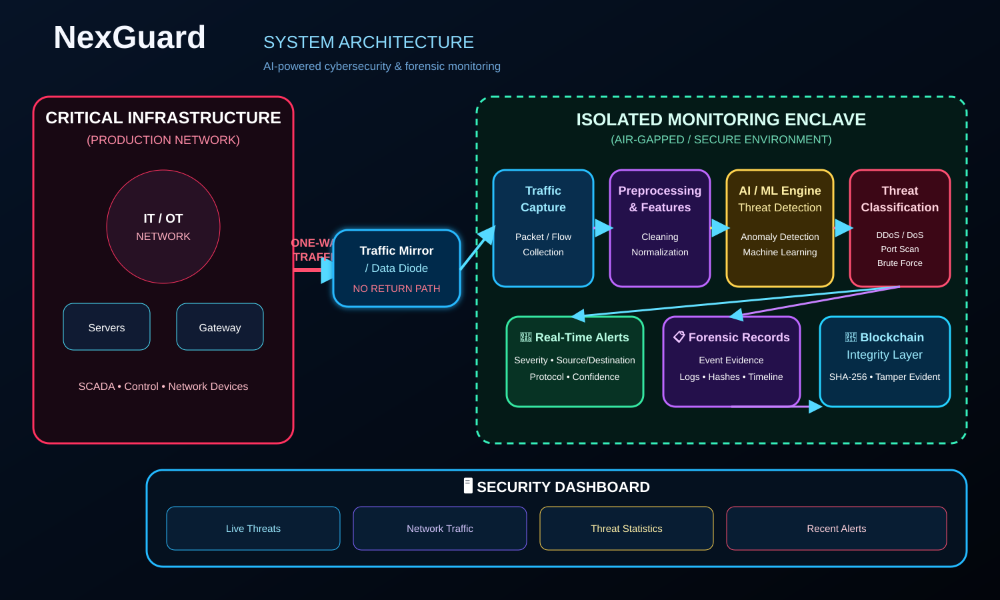
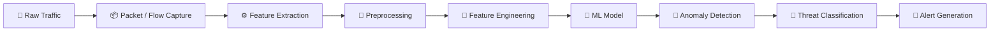
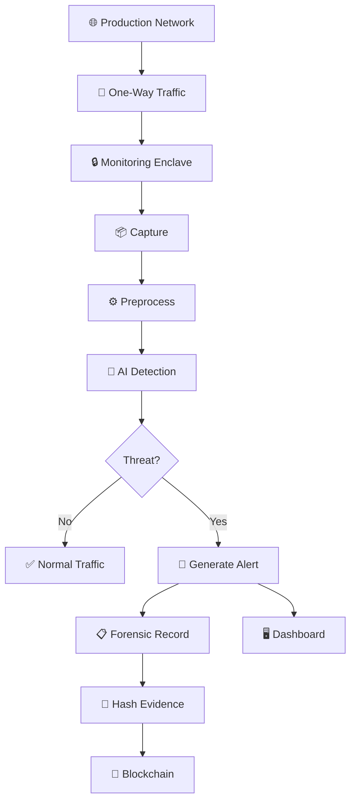

# 🛡️ NEXGUARD

<div align="center">

### AI-POWERED REAL-TIME CYBERSECURITY & FORENSIC MONITORING

**Smart India Hackathon 2026 · Problem Statement ID: SIH26145**

<p>
  
  
  
  
</p>

> **Observe Everything. Detect Threats Locally. Preserve Evidence.**

</div>

---

## 🌐 What is NexGuard?

**NexGuard** is an AI-powered cybersecurity monitoring and threat detection platform designed for **critical infrastructure networks**.

It combines:

- 🧠 AI/ML-based threat detection
- 📡 Real-time network traffic monitoring
- 🔒 One-way monitoring architecture
- 🚨 Threat classification and alerts
- 🔗 Blockchain-backed forensic integrity
- 🖥️ Security visualization

> **Core principle:** the monitoring system observes the production network without becoming a pathway back into it.

---

## 🚨 Problem → Solution

Critical infrastructure requires continuous security monitoring, but connecting analytics systems directly to production infrastructure can introduce additional attack surface.

NexGuard addresses this by combining **one-way traffic observation + an isolated monitoring enclave + local AI inference + tamper-evident forensic records**.

```text
🌐 PRODUCTION NETWORK
          │
          │  ONE-WAY TRAFFIC
          ▼
📡 TRAFFIC MIRROR / DATA DIODE
          │
          ▼
🔒 ISOLATED MONITORING ENCLAVE
          │
          ├── 📦 Traffic Capture
          ├── ⚙️ Preprocessing
          ├── 🧠 AI/ML Detection
          ├── 🎯 Threat Classification
          ├── 🚨 Real-Time Alerts
          └── 🔗 Blockchain Integrity

          ✕ NO RETURN PATH
```

---

## 🏗️ System Architecture

<div align="center">



<p><b>Figure 1 — NexGuard System Architecture</b></p>

</div>

---

## ⚡ Core Capabilities

| Capability | Purpose |
|---|---|
| 📡 Real-Time Monitoring | Analyze mirrored network traffic |
| 🧠 AI/ML Detection | Identify suspicious or anomalous behavior |
| 🎯 Threat Classification | Categorize detected activity |
| 🚨 Alerting | Surface actionable security events |
| 🔒 Network Isolation | Keep analytics separated from production |
| 🔗 Blockchain Integrity | Support tamper-evident forensic verification |
| 🖥️ Dashboard | Centralize security visibility |

---

## 🧠 AI-Powered Threat Detection



### Detection Pipeline

| Stage | Function |
|---|---|
| 📡 Capture | Acquire mirrored traffic |
| ⚙️ Preprocessing | Clean and normalize data |
| 🔢 Feature Engineering | Extract relevant network features |
| 🧠 ML Inference | Analyze behavior |
| 🔎 Detection | Identify suspicious activity |
| 🎯 Classification | Categorize threats |
| 🚨 Alerting | Generate security alerts |

---

## 🎯 Threat Categories

NexGuard can target threat classes such as:

| Threat | Detection Focus |
|:---:|---|
| 💥 DDoS / DoS | Abnormal traffic volume and patterns |
| 🔎 Port Scanning | Suspicious port probing |
| 🔑 Brute Force | Repeated authentication attempts |
| 🦠 Malicious Traffic | Suspicious communication patterns |
| 🚨 Network Intrusion | Abnormal connection behavior |
| 📈 Anomalies | Deviations from normal behavior |
| 🎯 C2 Communication | Suspicious command-and-control patterns |

> Exact threat classes depend on the datasets and models used in the implementation.

---

## 🔗 Forensic Integrity

NexGuard uses blockchain as an **integrity and verification layer**.

```text
🚨 Threat Detected
       ↓
📋 Security Event
       ↓
🔐 Evidence Hash
       ↓
🔗 Blockchain Ledger
       ↓
✅ Tamper-Evident Record
       ↓
🔍 Future Verification
```

---

## 🚨 Real-Time Alerting

Example security event:

```text
┌─────────────────────────────────────┐
│          🚨 SECURITY ALERT          │
├─────────────────────────────────────┤
│ Threat       : Port Scan            │
│ Severity     : HIGH                 │
│ Source       : 192.168.x.x          │
│ Destination  : 10.x.x.x             │
│ Protocol     : TCP                  │
│ Confidence   : 97%                  │
│ Status       : INVESTIGATION        │
└─────────────────────────────────────┘
```

---

## 🔄 End-to-End Workflow



---

## 🧩 Technology Stack

| Layer | Technology |
|:---:|---|
| 🧠 AI/ML | Python · Machine Learning |
| 📊 Data | Pandas · NumPy |
| 📡 Network | Packet / Flow Analysis |
| ⚙️ Backend | Python Backend / REST API |
| 🖥️ Frontend | Web Dashboard |
| 🔗 Blockchain | Integrity Layer |
| 🔒 Deployment | Local / On-Premise |

---

## 📂 Repository Structure

```text
SIH-26145/
├── README.md
├── LICENSE
├── .gitignore
├── requirements.txt
│
├── ai-engine/
│   ├── models/
│   ├── preprocessing/
│   ├── feature-engineering/
│   ├── detection/
│   └── inference/
│
├── backend/
│   ├── api/
│   ├── services/
│   └── database/
│
├── frontend/
│   ├── components/
│   ├── pages/
│   └── dashboard/
│
├── blockchain/
│   ├── contracts/
│   ├── services/
│   └── verification/
│
├── dataset/
│   └── README.md
│
├── deployment/
├── tests/
│
└── docs/
    ├── architecture/
    ├── research/
    ├── references/
    └── assets/
        └── architecture.svg
```

---

## 🚀 Getting Started

```bash
git clone https://github.com/areebaf29/SIH-26145.git
cd SIH-26145

python -m venv venv

# Windows
venv\Scripts\activate

# Linux / macOS
# source venv/bin/activate

pip install -r requirements.txt
```

Run the final application using the project entry point configured by the team.

---

## 📊 Dataset

Potential network-security datasets include:

- CICIDS
- UNSW-NB15
- NSL-KDD
- Other relevant intrusion-detection datasets

Large datasets should **not** be committed directly to the repository. Document sources and preprocessing in `dataset/README.md`.

---

## 🔬 Research Areas

- Critical Infrastructure Security
- Network Intrusion Detection
- AI-Based Threat Detection
- Anomaly Detection
- OT/IT Security
- Passive Network Monitoring
- Data Diodes
- Digital Forensics
- Blockchain Evidence Integrity

---

## 📈 Future Scope

- 🧠 Advanced deep-learning models
- 🔎 Zero-day anomaly detection
- 🤖 Automated incident correlation
- 🌐 Threat-intelligence integration
- 🔬 Explainable AI
- 🕵️ Automated forensic investigation
- 🏭 Multi-site monitoring
- ⚡ Edge-based inference
- 🧩 Advanced OT/ICS protocol analysis

---

## 👥 Team NexGuard

| Member | Role | GitHub |
|---|---|---|
| Areeba Fatima | AI / ML | [@areebaf29](https://github.com/areebaf29) |
| Pulkit Maheshwari | Blockchain | [@Pulkit-ops](https://github.com/Pulkit-ops) |
| Ayush Dhumal | Backend | Add GitHub username |
| Jayu Sihora | Frontend | Add GitHub username |
| Kirtan Maniar | Cybersecurity | (kirtanmaniar06-hub)  |
| Sakshi Aru | Research / Integration | Add GitHub username |

---

## 📜 License

This project is developed as part of **Smart India Hackathon 2026**.

---

<div align="center">

# 🛡️ NEXGUARD

### SEE → ANALYZE → DETECT → ALERT → PRESERVE

**AI-Powered Cybersecurity for Critical Infrastructure**

⭐ Star the repository to follow the project.

</div>
